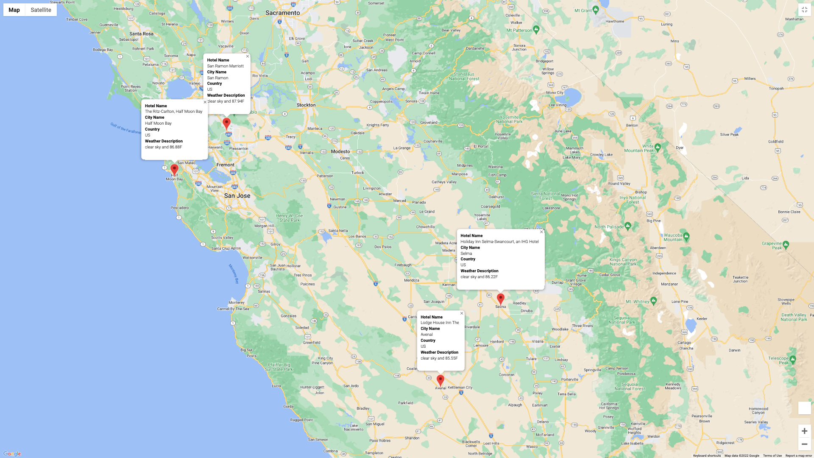

# World_Weather_Analysis

## Overview of project
- In this project we were asked to create an itinerary based on customers temperature preferences. We found four hotel locations in close proximity that had the temperature that they wanted. Below you will see that in my project I found four cities in Sunny California to accomodate the customers wishes of a minimum of 85 degrees and a max of 92. 

